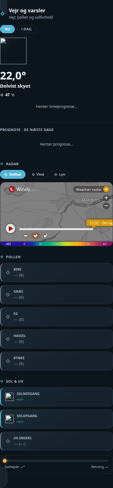

# HA Weather Card

## Neutral mobile preview



> Rendered at 390 px mobile width with fictional Home Assistant entities and values. No private dashboard, person, address, camera, or sensor data is included.


A single, self-contained Home Assistant Lovelace card that consolidates a full
weather page into one component:

- **Now / Today** hero toggle with a live temperature, feels-like, wind, humidity and UV
- **24h hourly strip** with icons and precipitation chance
- **Pollen** grid (works with any sensor exposing a `category` + `index_value` attribute, e.g. the Google Pollen integration)
- **Sun & UV** tab with sunrise/sunset and a live sun-elevation/compass indicator
- **Radar** tab with embedded precipitation, wind and lightning maps (Windy.com + Blitzortung)
- **5-day forecast** strip

## No custom sensors required

Everything is fetched live via the native `weather.get_forecasts` service on any
Home Assistant `weather.*` entity (Google Weather, Met.no, etc.) — no template
sensor or helper needed. Point `weather_entity` at your weather integration's
entity and the card does the rest.

## Configuration

```yaml
type: custom:ha-weather-card
title: Vejr og varsler
subtitle: Vejr, pollen og solforhold
weather_entity: weather.your_weather_entity
more_info_entity: weather.your_weather_entity
sun_entity: sun.sun
pollen:
  - name: Birk
    entity: sensor.google_pollen_birch
  - name: Græs
    entity: sensor.google_pollen_grass
radar_lat: 56.445
radar_lon: 9.961
```

Only `weather_entity` is required — everything else has a sensible default or
degrades gracefully if omitted.
